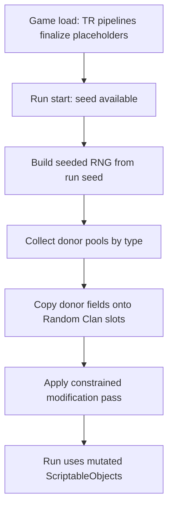

# Random Clan Feasibility Plan

## Verdict

**Feasible** as a C# + Harmony mod on [Trainworks-Reloaded](https://github.com/Monster-Train-2-Modding-Group/Trainworks-Reloaded), not as JSON-only content. Trainworks already supports clan/card/character registration, `AccessTools` field mutation, and post-load access to all `CardData` via `SaveManager.GetAllGameData().GetAllCardData()`. The hard parts are **per-run timing**, **safe deep-ish copies** (so vanilla cards are not corrupted), and **wording-preserving mutation rules**.

Assumption from your notes: **rooms in, relics out** (you wrote both “Don’t do relics” and “Do do rooms and relics”). Equipment and enhancers are also out of v1 unless you say otherwise.

## Scope (v1)

| Content | Approach |
| --- | --- |
| Spells | Placeholder spell slots → copy same-type donor → spell mods |
| Units | Placeholder unit card + character → copy donor unit/character → unit mods |
| Champions | Placeholder champion(s) → copy donor champion card/character; **upgrade tree filled from a global pool of all champion `CardUpgradeData`** |
| Rooms | Placeholder room cards → copy same-type donor room; room-safe numeric/status tweaks only if they do not change wording |
| Relics | **Excluded** |
| Equipment / enhancers | **Excluded** for v1 |

**Modification catalog (wording-safe only):**

- **Spells:** Status Effect Adjustment (only if spell already has a status effect), Trait Adjustment, Number Adjustment, Cost Adjustment. **No** target-mode / target-team / targetless changes.
- **Units:** Health Adjustment, Attack Adjustment, Status Adjustment, Status Count Adjustment, plus validated Cost Adjustment when the unit card has a cost. Same rule: skip anything that would rewrite the printed effect text structure.

## Recommended architecture

### 1. Static shell (JSON via Trainworks)

Use the mod template pattern in [`Plugin.cs`]({{cookiecutter.__project_slug}}/{{cookiecutter.__project_slug}}.Plugin/Plugin.cs): a real `ClassData` clan with fixed IDs for:

- N spell slots, M unit slots, 1–2 champions, room slots, starter card, clan banner/pools
- Placeholder names/art so the clan is selectable before mutation
- Stable GUIDs (Trainworks deterministic IDs) so save/run references stay valid

JSON defines **slots**, not final mechanics.

### 2. Per-run randomizer (C# + Harmony)

Hook a run-start / seed-available point (investigate `RunSetupScreen` / `SaveManager` run init; TR already patches `RunSetupScreen` for custom clans). On each new run:

1. Read run seed → `System.Random` or game RNG wrapper seeded from it (same seed ⇒ same clan).
2. Snapshot or re-apply from pristine donor templates each run (do **not** mutate vanilla ScriptableObjects).
3. For each Random Clan slot, pick a donor of matching `card_type` (and unit vs ability constraints).
4. Copy mechanics onto the placeholder (new list instances; clone effect/trait/trigger ScriptableObjects when modifying them).
5. Run the modification pipeline below.
6. Optionally refresh displayed name/description only when text still matches tokens; otherwise keep donor description (since targets/structure are unchanged).

### 3. Copy rules (critical for stability)

- **Spells:** copy cost, rarity (optional), effects list, traits, card triggers; keep Random Clan `class`, pools, and art/name unless you explicitly want donor art.
- **Units:** copy `CardData` spawn effect’s character link by rewriting the **placeholder** `CharacterData` (HP, ATK, size, subtypes carefully, starting statuses, character triggers, ability card) rather than pointing at vanilla `CharacterData`.
- **Champions:** copy base champion card/character; rebuild `upgrade_tree` by sampling from **all champion upgrades** across clans (enumerate registered `CardUpgradeData` / walk all `ClassData` champion trees). Filter upgrades that require clan-specific subtypes or invalid triggers when possible.
- **Rooms:** copy room modifier params that are numeric/status only; avoid subtype/target swaps that change wording.
- **Never** share mutable list references with vanilla; never in-place edit donor effect objects.

### 4. Modification pipeline

Implement small, validated mutators. Each mutator: `CanApply(card/character) → Apply(rng)`.

**Spell mutators**

- **Status Effect Adjustment:** if any effect has `param_status_effects`, swap status ID within a curated compatible pool (same “family” if needed) **or** change count only when swap is too wording-heavy; prefer count/type swaps that keep `[status]` token shape.
- **Trait Adjustment:** replace/swap traits from a whitelist of wording-compatible traits (e.g. Consume ↔ similar), or adjust trait `param_int*` only.
- **Number Adjustment:** scale effect `param_int` / status counts by discrete multipliers (e.g. ±1 step, 50%/150%) with clamps.
- **Cost Adjustment:** adjust ember cost within `[0, max]` with rarity-aware clamps; reject if card is unplayable (cost absurdly high for effect).

**Unit mutators**

- **Health / Attack Adjustment:** mutate `CharacterData` health / attack_damage with clamps by size/rarity.
- **Status Adjustment / Status Count Adjustment:** only on existing starting statuses or status-applying ability effects; change status type (curated) or count; no new effect rows that would require new description lines if that breaks tokens.
- **Cost Adjustment:** validate against unit rarity/size; skip champions if cost is fixed at 0.

**Validation gate (shared):** after mutation, assert non-null effects, non-null VFX where required, cost bounds, HP/ATK > 0, status counts ≥ 0, and that target fields were untouched.

### 5. Champion upgrade pool

- Build once per run: `List<CardUpgradeData>` from every clan’s champion upgrade trees (and/or upgrade register filtered to champion-path upgrades).
- For each Random Clan champion path slot, sample upgrades with simple constraints (e.g. path depth I/II/III roughly by upgrade magnitude if detectable, or random with uniqueness).
- Risk: some upgrades assume specific champion subtypes or grant triggers that reference missing VFX — mitigate with try/filter and fallback to donor’s original upgrade if validation fails.

## Main risks (ordered)

1. **Shared ScriptableObject corruption** — copying by reference mutates vanilla forever. Mitigation: clone-on-write for any modified effect/trait/trigger/character fields.
2. **Description drift** — MT2 text tokens (`[effect0.status0.power]`) usually still work if effect *structure* is preserved; status *name* tokens may change display, which is acceptable. Do not add/remove effect slots in v1.
3. **Unit ability cards** — units with abilities are a second `CardData`; must copy/mutate in sync with character `ability` reference.
4. **Champion upgrades from foreign pools** — highest crash/soft-lock risk; needs validation and fallbacks.
5. **Run-seed hook accuracy** — must fire once per run after seed is known, before cards are dealt; must re-roll on new run and not double-apply.
6. **Logbook / clan select preview** — mutating live definitions may show last run’s randomization outside a run; keep placeholders until run start, or restore defaults when returning to menu.

## Prototype milestones (when you choose to build)

1. **Spike:** Harmony hook + seeded RNG + log “would copy spell X → slot Y” (no mutation yet).
2. **Spell copy + cost/number mods** on placeholder clan spells only.
3. **Unit copy + HP/ATK/status mods** including ability card sync.
4. **Champion copy + global upgrade-pool tree rebuild** with validation/fallback.
5. **Rooms** copy + safe numeric tweaks.
6. Playtest pass: same seed reproducibility, no vanilla corruption, no null VFX crashes.

## What this repo is today

[Mod-Template](README.md) is a cookiecutter scaffold (clan JSON examples, Harmony optional). Random Clan would be a **new mod generated from this template**, with most logic under `code/` + Harmony patches, not more JSON definitions alone.

## Out of scope for this feasibility pass

- Relics, equipment, enhancers
- Target-mode randomization
- Full procedural description rewriting
- Balance tuning beyond clamps / validation
